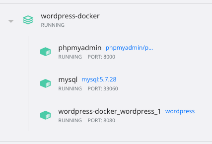

# wordpress-docker

## Install

1. Install [docker engine](https://docs.docker.com/engine/install/).
2. After docker engine installed, download this repository.
3. Using command line tools to get into the repository folder.
4. Using command line tools to install related docker by `docker-compose.yml`.
   ```bash
   docker-compose up -d
   ```

5. You will see docker in docker desktop app, after dockers is installed.
   
6. Using browser to open phpMyAdmin([http://localhost:8000/](http://localhost:8000/)), then craete a database named as `wordpress`, using `utf8mb4_unicode_ci` charset.
7. Using browser to open WordPress([http://localhost:8080/](http://localhost:8080/)), you can now start using wordpress with the installation page.
8. Filling all the required information, click start install.
9. Now you can visit control pannel([http://localhost:8080/wp-login.php](http://localhost:8080/wp-login.php)) and your wordpress web page([http://localhost:8080/](http://localhost:8080/)).
